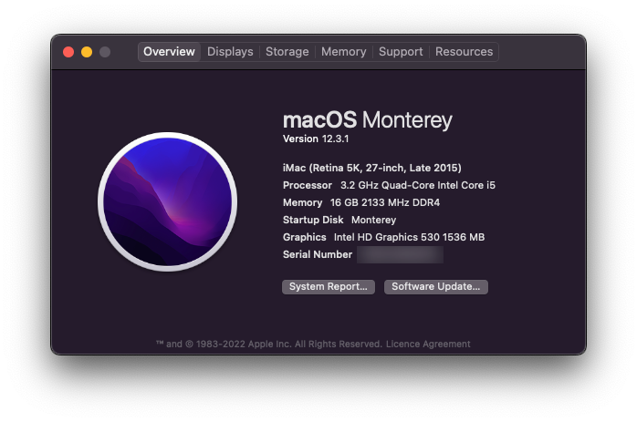

# Hackintosh on ASRock H170 Pro4
Verified working with macOS version 12.3.1 on OpenCore 0.7.8

## Hardware
|Parts   	|Model                 	|
|---	    |---                	|
|Motherboard|ASRock H170 Pro4   	|
|CPU    	|Intel Core i5-6500 	|
|Graphics   |Intel HD Graphics 530 	|

## BIOS Settings
Version 1.60

Advanced \ USB Configuration \ Legacy USB Support: `UEFI Setup Only`

Advanced \ USB Configuration \ PS/2 Simulator: `Disabled`

Boot \ Fast Boot: `Disabled`

Boot \ CSM(Compatibility Support Module) \ CSM: `Disabled`

## How To Use
Read the [Dortania's OpenCore Install Guide](https://dortania.github.io/OpenCore-Install-Guide/) first

To use the EFI from this repo, you need to update the `SystemSerialNumber`, `SystemUUID`, `MLB`, `ROM` values in `config.plist`.

## Known Issues
- Cannot wake from sleep
    - Ref 1: [WhateverGreen's Intel® HD Graphics FAQs](https://github.com/acidanthera/WhateverGreen/blob/master/Manual/FAQ.IntelHD.en.md)
    - Ref 2: [Open Core 0.57 Intel® HD Graphics 530 (i5 6500) sleep crashes and DP port not working on MacOS 10.15 Catalina !](https://www.reddit.com/r/hackintosh/comments/gatinh/open_core_057_intel_hd_graphics_530_i5_6500_sleep/)

## Credits
- [OpenCore](https://github.com/acidanthera/OpenCorePkg)
- [Dortania's OpenCore Install Guide](https://dortania.github.io/OpenCore-Install-Guide/)
- [tonymacx86](https://www.tonymacx86.com/)
